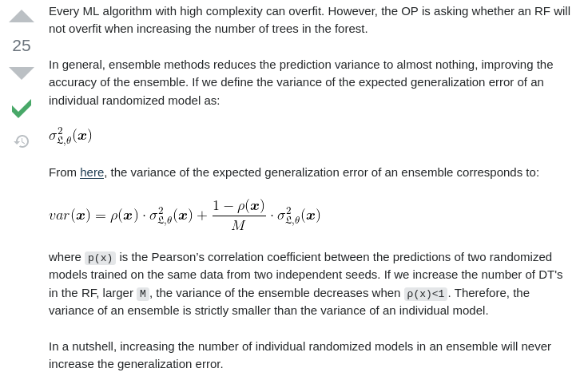
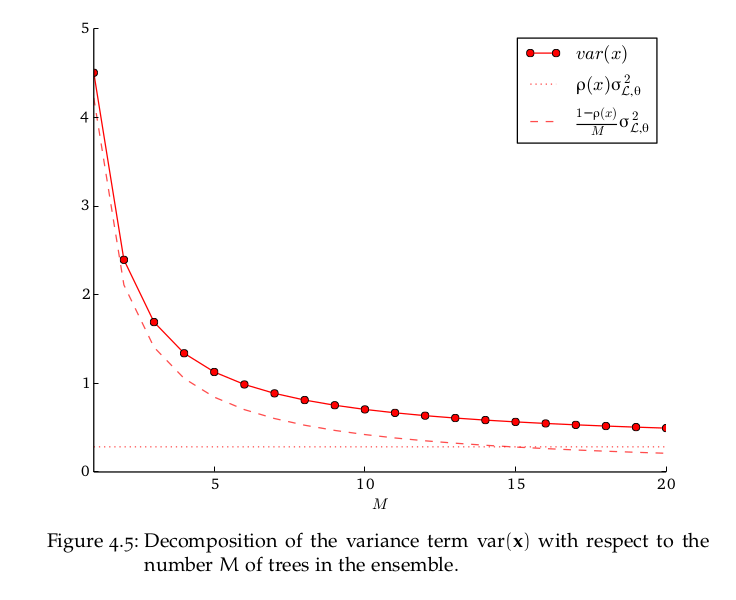
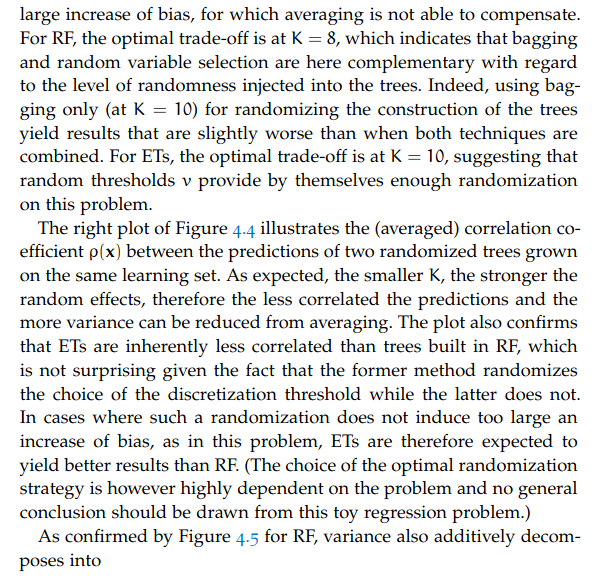
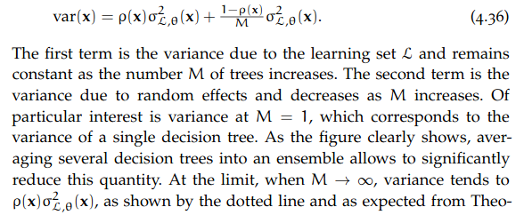

# Why random forest overfit

# Detail formula

# Reference 

[Do random forest overfit](https://datascience.stackexchange.com/questions/1028/do-random-forest-overfit)

[Bias-Variance and Error Analysis](http://cs229.stanford.edu/notes2020spring/bias-variance-error-analysis.pdf)
